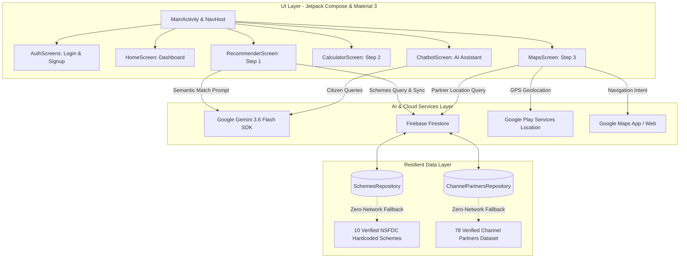

# 🇮🇳 Jankar Nagrik (जानकार नागरिक)
### *AI-Driven Concessional Scheme Matching & Citizen Enablement for Marginalized Entrepreneurs*

[](https://kotlinlang.org)
[-3DDC84.svg?style=flat&logo=android&logoColor=white)](https://developer.android.com)
[](https://developer.android.com/jetpack/compose)
[](https://ai.google.dev/)
[](https://firebase.google.com/)
[](https://developers.google.com/maps)
[](https://www.sih.gov.in/)

---

## 📌 Problem Context: Smart India Hackathon (SIH26092)

* **Ministry:** Ministry of Social Justice and Empowerment (MoSJE)
* **Apex Body:** National Scheduled Castes Finance and Development Corporation (NSFDC)
* **Problem Statement:** *AI-Driven Scheme Matching for Marginalized Entrepreneurs*
* **Core Mission:** Bridge information asymmetry, eliminate procedural complexity, and empower Scheduled Caste (SC) entrepreneurs and marginalized citizens to discover verified concessional credit schemes, calculate real EMI burdens with moratorium benefits, and locate the nearest authorized channel partners.

---

## 🌟 Key Features & Capabilities

```
┌─────────────────────────────────────────────────────────────────────────┐
│                      Jankar Nagrik: 3-Step Guided Flow                  │
├───────────────────┬─────────────────────────┬───────────────────────────┤
│  Step 1: Discover │    Step 2: Calculate    │      Step 3: Connect      │
│  AI Scheme Match  │   EMI & Moratorium      │   Nearest Channel Partner │
│  (Recommender)    │   (Smart Calculator)    │   (Geo-Locator & Maps)    │
└───────────────────┴─────────────────────────┴───────────────────────────┘
```

### 1. 🤖 Intelligent AI Scheme Matcher (Step 1)
* **Semantic Trade Matching:** Powered by **Google Gemini 3.6 Flash**, the app analyses the entrepreneur's trade (e.g., E-Rickshaw, Kirana, Tailoring, Dairy, Artisanship, Professional higher education), capital requirements, annual household income, location (rural/urban), and gender.
* **Dual-Tier Matching Algorithm:**
  1. *Deterministic Rule Filtering:* Enforces official NSFDC ceilings, income limits (₹5 Lakhs/year where applicable), and target quotas.
  2. *Gemini LLM Scoring & Fit Reasoning:* Generates an AI match confidence score (75%–98%), localized explanation (in English or Hindi) of why the scheme fits, gap advice (e.g., margin money subsidies, female rebates), and a tailored document checklist.
* **Quick-Select Chips:** One-tap presets for high-demand trades (🛺 E-Rickshaw, 🧵 Tailoring, 👞 Traditional Artisan, 🛒 Kirana, 🐄 Dairy, 💻 Cyber Cafe, 🎓 Higher Education).

### 2. 🧮 Interactive Concessional EMI & Moratorium Calculator (Step 2)
* **Contextual Auto-Population:** Pre-fills recommended loan amounts (90% project cost), concessional interest rates (4.0% – 8.0%), tenure, and official moratorium periods based on the matched scheme.
* **Moratorium-Aware Formula:** Accurately deducts moratorium grace periods before installment amortization:
  $$\text{EMI} = \frac{P \times r \times (1+r)^n}{(1+r)^n - 1} \quad \text{where } n = (\text{Tenure}_{\text{years}} \times 12) - \text{Moratorium}_{\text{months}}$$
* **Dynamic Sliders:** Allows beneficiaries to simulate adjustments in loan amount, interest rate, tenure, and moratorium months with live EMI recalculation.

### 3. 🗺️ GPS Channel Partner Locator (Step 3)
* **78 Verified NSFDC Channel Partners:** Complete national coverage across all Indian States and Union Territories:
  * **38 State Channelizing Agencies (SCAs)** (e.g., MPSEDC, Mahapreet, APSCCFC)
  * **26 Regional Rural Banks (RRBs)** (e.g., Aryavart Bank, Baroda UP Bank)
  * **7 RBI-Registered NBFC-MFIs** (e.g., Fusion, Satin, Muthoot Microfin)
  * **2 Cooperative Banks & Societies**
* **Nearest-First Sorting:** Uses Android Fused Location Provider to calculate real-time geodesic distances from citizen GPS coordinates.
* **1-Tap Navigation Intent:** Directly launches turn-by-turn routing in Google Maps app with verified physical branch addresses.

### 4. 💬 Multilingual AI Scheme Assistant (Chatbot)
* In-app conversational assistant built with Gemini 3.6 Flash.
* Answers citizen questions regarding eligibility rules, required identity/income certificates, moratorium grace terms, and application centers.
* Responds natively in **Hindi (हिन्दी)** or **English** based on the user's active language toggle.
* Resilient offline fallback providing verified statutory guidance even without network connectivity.

### 5. 🌐 Accessibility & Inclusive Design
* **Bilingual Localization:** Instant language switching across all screens (Hindi 🇮🇳 / English 🇬🇧) via a custom `CompositionLocalProvider`.
* **Dark & Light Mode:** Fully adaptive Material 3 theme persisting citizen preferences in `SharedPreferences`.
* **Clean Authentication:** Secure Email/Password onboarding with client-side regex validation and session management.

---

## 📊 Catalog of Verified NSFDC Schemes

The application catalogs 10 official concessional schemes verified against official guidelines from [nsfdc.nic.in](https://nsfdc.nic.in/scheme) and the NSFDC Audited Annual Report:

| Scheme ID | Scheme Name | Loan / Project Ceiling | Concessional Interest Rate | Moratorium | Target Beneficiary |
| :--- | :--- | :--- | :--- | :--- | :--- |
| `micro_finance` | **Micro Finance Scheme (MFS)** | Up to ₹1,40,000 (Loan: ₹1.25L) | 6.5% p.a. | 3 Months | SC entrepreneurs (tiny units) |
| `term_loan` | **Term Loan Scheme** | ₹1.40L to ₹50,00,000 (Loan: ₹45L) | 8.0% p.a. via SCAs | 6–12 Months | Medium commercial, transport, industrial projects |
| `mahila_samriddhi` | **Mahila Samriddhi Yojana (MSY)** | Up to ₹1,40,000 | 4.0% p.a. (Subsidized) | 3 Months | Scheduled Caste women & SHGs |
| `green_business` | **Green Business Scheme (GBS)** | Up to ₹30,00,000 | 8.0% p.a. | 6–12 Months | Clean tech: E-rickshaws, solar, bio-gas |
| `educational_loan` | **Educational Loan Scheme (ELS)** | Up to ₹40,00,000 | 6.5% p.a. *(6.0% for women)* | Course + 1 Year | Professional/technical higher studies |
| `udyam_nidhi` | **Udyam Nidhi Yojana (UNY)** | Up to ₹5,00,000 | 13.0% – 15.0% p.a. | 3 Months | Channeled via Cooperative & Small Finance Banks |
| `aajeevika_microfinance` | **Aajeevika Micro-Finance** | Up to ₹1,40,000 | 15.0% p.a. via NBFC-MFIs | 3 Months | Need-based micro-enterprises |
| `pm_vishwakarma` | **PM Vishwakarma Scheme** | Up to ₹3,00,000 (Tranches 1 & 2) | 5.0% p.a. Subsidized | 3–6 Months | 18 notified artisan & craft trades (+₹15k toolkit) |
| `stand_up_india` | **Stand-Up India Scheme** | ₹10 Lakhs to ₹1.00 Crore | 7.5% – 9.5% (Bank Rate) | Up to 18 Months | Greenfield SC & Women enterprises |
| `pmegp_marginalized` | **PMEGP (Marginalized Category)** | Up to ₹50 Lakhs | Commercial Rate | 6 Months | 35% Rural / 25% Urban Non-repayable Subsidy |

---

## 🏗️ Architecture & Technology Stack



### Core Technologies:
* **Language & SDK:** Kotlin 2.0+, Android SDK (Min SDK: 24, Target SDK: 37)
* **UI Framework:** Jetpack Compose, Material 3, Activity Compose, Compose Navigation, Material Icons Extended
* **Generative AI:** Google AI Client SDK (`com.google.ai.client.generativeai:0.9.0`) using `gemini-3.6-flash`
* **Cloud & Database:** Firebase BOM 33.7.0 (`firebase-auth`, `firebase-firestore`, `kotlinx-coroutines-play-services`)
* **Geo & Location:** Google Maps Compose 4.3.0, Play Services Maps 18.2.0, Play Services Location 21.3.0

---

## 📂 Project Structure

```
schemes/
├── app/
│   ├── src/main/
│   │   ├── java/com/ashstudios/JankarNagrik/
│   │   │   ├── MainActivity.kt              # App entry point, NavHost, Drawer, Theme & Language toggles
│   │   │   ├── AuthScreens.kt               # Login and Signup screens with validation
│   │   │   ├── HomeScreen.kt                # Citizen dashboard & applied schemes tracker
│   │   │   ├── RecommenderScreen.kt         # Step 1: Business profiling & Gemini AI scheme matcher
│   │   │   ├── CalculatorScreen.kt          # Step 2: Interactive EMI & moratorium calculator
│   │   │   ├── MapsScreen.kt                # Step 3: Fused Location partner locator & Maps intents
│   │   │   ├── ChatbotScreen.kt             # Bilingual Gemini 3.6 Flash conversational assistant
│   │   │   ├── FlowStepIndicator.kt         # Visual 3-step citizen journey progress header
│   │   │   ├── data/
│   │   │   │   ├── Scheme.kt                # Scheme data model with Firestore annotations
│   │   │   │   ├── SchemesRepository.kt     # Firestore sync, cleanup, and verified 10-scheme catalog
│   │   │   │   ├── ChannelPartner.kt        # ChannelPartner data model (lat/long, handles_schemes)
│   │   │   │   └── ChannelPartnersRepository.kt # Firestore sync & 78 verified NSFDC partner records
│   │   │   └── ui/theme/
│   │   │       ├── Color.kt                 # Material 3 color palettes
│   │   │       ├── Theme.kt                 # SchemesTheme composable supporting Dark/Light mode
│   │   │       └── Type.kt                  # Typography definitions
│   │   ├── res/                             # Vector drawables, mipmaps, strings, and styles
│   │   └── AndroidManifest.xml              # Permissions, Activity definitions, and Maps API metadata
│   ├── build.gradle.kts                     # App module dependencies, BuildConfig fields & SDK targets
│   └── google-services.json                 # Firebase configuration file
├── build.gradle.kts                         # Project build configuration
├── settings.gradle.kts                      # Gradle plugin management
└── README.md                                # Project documentation
```

---

## 🚀 Getting Started & Setup Guide

### Prerequisites
1. **Android Studio:** Hedgehog (2023.1.1) or newer / Ladybug.
2. **JDK:** Java Development Kit 17 (recommended: OpenJDK 17).
3. **Android Device / Emulator:** API Level 24 (Android 7.0) or higher with Google Play Services.
4. **Google Gemini API Key:** Obtain from [Google AI Studio](https://aistudio.google.com/).
5. **Firebase Project:** Created on [Firebase Console](https://console.firebase.google.com/) with Cloud Firestore and Authentication enabled.

---

### Step 1: Clone the Repository
```bash
git clone https://github.com/Harshal-Deshmukh/Jankar-Nagrik.git
cd Jankar-Nagrik
```

### Step 2: Configure Gemini API Key
In the root project directory, locate or create `local.properties` and add your Gemini API key:
```properties
sdk.dir=C\:\\Path\\To\\Your\\Android\\Sdk
gemini.api.key=YOUR_GEMINI_API_KEY_HERE
```
> 💡 *The Gradle build configuration (`app/build.gradle.kts`) automatically injects `gemini.api.key` into `BuildConfig.GEMINI_API_KEY` at compile time.*

### Step 3: Firebase Configuration
1. Register your Android app package `com.ashstudios.JankarNagrik` in your Firebase Console.
2. Download `google-services.json` and place it in the `app/` folder (`app/google-services.json`).
3. Ensure Firestore Security Rules permit read/write for testing or authenticated users.

### Step 4: Configure Google Maps API Key (Optional for Custom Map Tiles)
In `app/src/main/AndroidManifest.xml`, update the meta-data element if you wish to display custom Map tiles:
```xml
<meta-data
    android:name="com.google.android.geo.API_KEY"
    android:value="YOUR_GOOGLE_MAPS_API_KEY" />
```
*(Note: Turn-by-turn navigation via external Google Maps intent functions out-of-the-box regardless).*

### Step 5: Build and Run
1. Open the project in **Android Studio**.
2. Perform a Gradle Sync (**File > Sync Project with Gradle Files**).
3. Connect an Android device with USB debugging enabled or launch an AVD emulator.
4. Click **Run ('app')** or run via command line:
```powershell
./gradlew installDebug
```

---

## 🧪 Testing & Verification

* **Offline Mode Verification:** Turn off Wi-Fi/Mobile Data on the device. Verify that:
  * `SchemesRepository` loads the 10 verified schemes from local defaults.
  * `CalculatorScreen` performs instantaneous loan amortization.
  * `ChannelPartnersRepository` loads all 78 verified partners and computes nearest distances.
  * `ChatbotScreen` gracefully falls back to pre-configured official guidance.
* **Bilingual Switch Test:** Open the navigation drawer, tap **"हिंदी में बदलें"** (Switch to Hindi), and verify that all UI labels, step indicators, scheme cards, and chatbot prompts switch to Hindi.
* **Auto-Population Workflow:**
  1. Open **Find Schemes**, fill in a business idea (e.g., *₹1,20,000 for Tailoring shop*), select *Female beneficiary*, and tap **Find Schemes**.
  2. Tap **Calculate EMI** on the recommended card.
  3. Verify that the **Calculator** opens with the loan amount auto-populated at 90% project cost, interest set to 4.0% (Mahila Samriddhi rate), and moratorium set to 3 months.
  4. Tap **Proceed to Partner Locator** and verify nearby SCAs and banks are ranked nearest-first.

---

## 🏆 Smart India Hackathon (SIH 2026) Value Proposition

| Traditional Citizen Experience | Jankar Nagrik AI Solution |
| :--- | :--- |
| Citizens navigate fragmented, jargon-heavy PDF circulars across multiple portals. | Unified, conversational AI matching tailored to individual trade, capital, and demographic factors. |
| Citizens are unaware of moratorium grace periods or woman beneficiary rebates. | Exact financial breakdown with subsidized rates, female rebates, and moratorium capital calculations. |
| Confusion about physical application points and middlemen exploitation. | Direct connection to 78 verified State Channelizing Agencies and banks with 1-click GPS routing. |
| Language barriers exclude rural, non-English speaking entrepreneurs. | Full Hindi and English localization designed with simple vernacular terminology. |

---

## 📄 License & Attribution

* **Project:** Jankar Nagrik (SIH 2026 Project)
* **Author / Maintainer:** [Harshal Deshmukh](https://github.com/Harshal-Deshmukh) & Ash Studios Team
* **Data Sources:** Official schemes published by the [National Scheduled Castes Finance & Development Corporation (NSFDC)](https://nsfdc.nic.in) and audited Annual Reports.